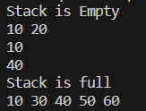

# Stack
A cpp code showing basic implementation of Stack
## Theory
 A stack is a linear data structure in which elements can be inserted and deleted only from one side of the list, called the top. A stack follows the LIFO (Last In First Out) principle, i.e., the element inserted at the last is the first element to come out. The insertion of an element into the stack is called push operation, and the deletion of an element from the stack is called pop operation. In stack, we always keep track of the last element present in the list with a pointer called top.

The diagrammatic representation of the stack is given below: 


Applications of stack:

1. Some CPUs have their entire assembly language based on the concept of performing operations on registers that are stored in a stack.
2. Stack structure is used in the C++ run-time system.

## Outcome of the code
The basic implementation of Stacks.

## Algorithm
1. Start
2. Create a Class called Stacks
3. Create the basic functions (Add elements, remove elements etc). Keep in mind all the possible scenerios. (This stack is made by arrays, so scenerios like stack full, stack empty etc)
4. Try all the possible functions.(Adding, removing, Displaying etc)
5. End

## Explaination of the Output
- The function```Push()``` in the class Stack is used to add an element in the stack.
- The function ```Pop()``` in the class Stacks is used to remove an Element from the stack.
- The function ```Pop()``` in the class Stacks is used to print/see the topmost element of the stack.
- The function ```Print()``` in the class Stacxk is used to print all the elements in the stack.
- The Stack is empty, hence the first line outputs the stack is empty.
- We **Push** the elements **10** and **20** into the stack and the **Print** the stack.
- We **Pop** the element **20** and then **Print** the stack.
- We **Push** the elements **30** and **40** and **Peek** at the topmost elemenst of the stack.
- We **Push** the elements **50**,**60** and **70** but theres no space for **70** so we get the output as the stack is full.
- We **Print** the stack.

## Output Screenshot

